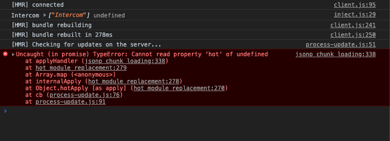
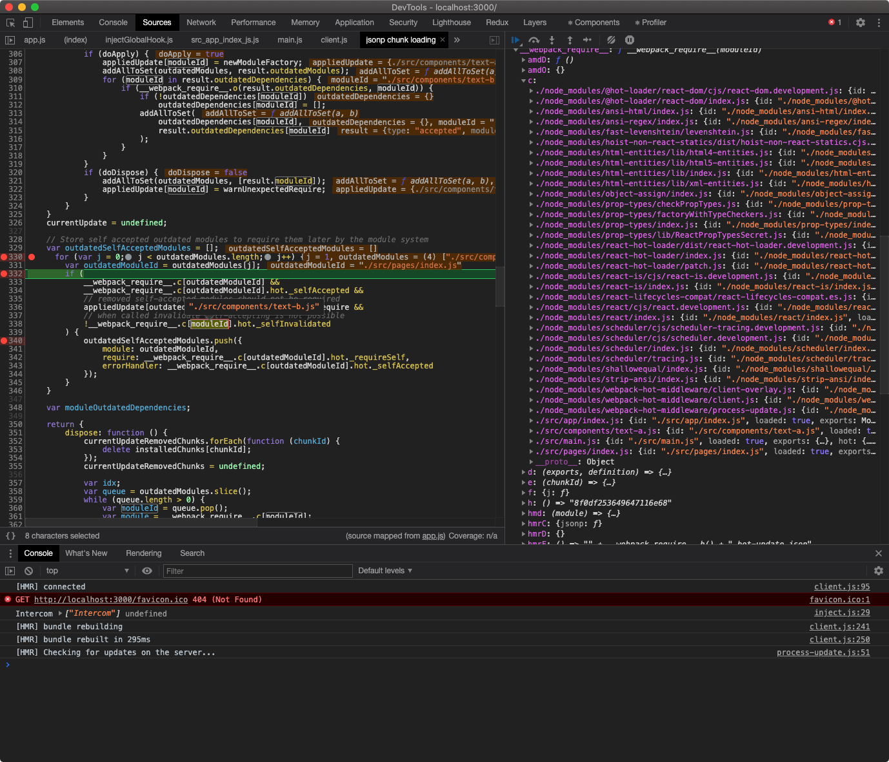

webpack-react-hmr-undefined
===========================
> This is the minimal reproducible repo for an issue in [webpack](https://github.com/webpack/webpack)

How to Reproduce Error
----------------------
1. Clone repo and cd

    ```
    git clone https://github.com/shirohana/webpack-react-hmr-undefined

    cd webpack-react-hmr-undefined
    ```

2. Install dependencies

    ```
    yarn install
    ```

3. Launch the dev server

    ```
    make start
    ```

    or

    ```
    node ./server/index.js
    ```

4. Open browser with url (default: http://127.0.0.1:3000) and open DevTools

5. Edit file `src/components/text-a.js` like:

    ```diff
      // @flow
      import React from 'react'

    - // import TextB from './text-b'
    + import TextB from './text-b'

      export default () => {
        return React.createElement(
          'div',
          null,
          React.createElement('h2', null, 'Text A'),
          // React.createElement(TextB)
        )
      }
    ```

6. You'll see the Error in Console



Error Stack
-----------
You can see there's no corresponding `moduleId` in ModuleCache.



Seems the cache had be invalidated in unexpect. I have no idea how it happened
in actual, but there's a simplest way to **do a quickfix** (´・ω・｀)

##### `webpack/lib/hmr/JavascriptHotModuleReplacement.runtime.js`

```diff
  207  if (
  208    $moduleCache$[outdatedModuleId] &&
  209    $moduleCache$[outdatedModuleId].hot._selfAccepted &&
  210    // removed self-accepted modules should not be required
  211    appliedUpdate[outdatedModuleId] !== warnUnexpectedRequire &&
  212    // when called invalidate self-accepting is not possible
+        $moduleCache$[moduleId] &&
  213    !$moduleCache$[moduleId].hot._selfInvalidated
  214  ) {
```
